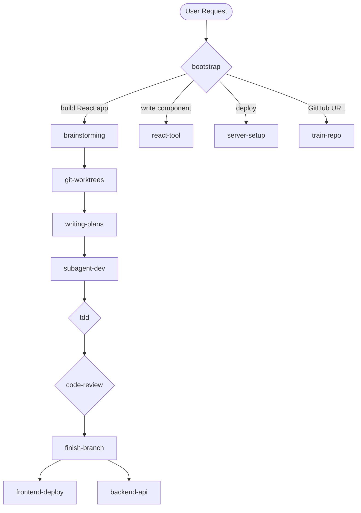

# React Full-Stack Development Pipeline

> Claude Code Plugin — 20 skills, 6 agents, 14 trained libraries. Complete React development lifecycle from brainstorming to backend deployment.

[](https://github.com)
[](https://github.com)
[](https://github.com)
[](https://github.com)

## Concept

A Claude Code plugin that automates the complete React development workflow. Inspired by the [superpowers](https://github.com/obra/superpowers) plugin architecture, it provides a structured pipeline from initial brainstorming through production deployment.

**What it does:**
- **Guides** you through requirements → design → plan → code → review → deploy
- **Checks** 14+ trained React libraries before writing custom code
- **Dispatches** specialized subagents for implementation, review, and deployment
- **Deploys** to Vercel, VPS, or Docker with CI/CD pipelines

## Pipeline Flow



## Installation

```bash
# Clone to Claude Code plugins directory
git clone git@github.com:YOUR_USER/react-fullstack-pipeline.git \
  "D:\Claude Code\react-frontend-tool"

# Or install via marketplace (if published)
# Claude Code will auto-discover skills and hooks
```

## Quick Start

1. **Install** the plugin into your Claude Code plugins directory
2. **Start a session** — the bootstrap skill auto-loads via SessionStart hook
3. **Say what you need:**
   - "Build a React dashboard for our team" → triggers brainstorming pipeline
   - "Add a drag-and-drop todo list" → triggers react-tool (checks knowledge base)
   - "Deploy my app to production" → triggers server-setup + frontend-deploy
   - "Train this library: https://github.com/..." → triggers train-repo

## Skills Reference

### Process Pipeline (8 skills)

| Skill | When to Use | Next Step |
|-------|-------------|-----------|
| `bootstrap` | Every session start | Routes to correct skill |
| `brainstorming` | "Build/create a React app" | writing-plans |
| `git-worktrees` | Before feature work | writing-plans |
| `writing-plans` | After design approved | subagent-dev |
| `subagent-dev` | Execute implementation plan | tdd → code-review → finish-branch |
| `tdd` | Before writing code | Test → Code → Refactor |
| `code-review` | Between tasks, before merge | finish-branch |
| `finish-branch` | All tasks complete | deploy or merge |

### React Domain (4 skills)

| Skill | When to Use |
|-------|-------------|
| `react-tool` | Write React code (checks 14 trained repos) |
| `train-repo` | Train a GitHub React library |
| `component-design` | Design new component props/composition |
| `styling-system` | CSS/theme architecture decisions |

### Deployment (4 skills)

| Skill | When to Use |
|-------|-------------|
| `server-setup` | Provision VPS, Nginx, SSL |
| `frontend-deploy` | Deploy React build to production |
| `docker-setup` | Dockerfile + docker-compose |
| `ci-cd` | GitHub Actions workflows |

### Backend (4 skills)

| Skill | When to Use |
|-------|-------------|
| `backend-api` | Build REST/GraphQL API |
| `database` | Schema design, ORM, migrations |
| `auth` | JWT/OAuth/RBAC |
| `api-client` | TanStack Query, tRPC integration |

## Agents (6 types)

| Agent | Role | Review Stage |
|-------|------|-------------|
| `react-implementer` | Execute single task (components, hooks, pages) | — |
| `react-spec-reviewer` | Verify implementation matches spec | Stage 1 |
| `react-code-reviewer` | Code quality: hooks, a11y, performance | Stage 2 |
| `react-trainer` | Clone, explore, extract knowledge from GitHub repos | — |
| `react-deployer` | Build, configure, deploy, verify | — |
| `react-backend-engineer` | Build API endpoints, database schemas, auth flows | — |

## Knowledge Base

14 trained React libraries organized in 12 categories:

| Category | Libraries | Components |
|----------|-----------|------------|
| **UI Libraries** | shineout (41), beeshell (30), datav-react (38) | 109 |
| **Headless** | react-hook-form, zustand, tanstack-table, dnd-kit | 4 |
| **Data Fetching** | tanstack-query, swr | 2 |
| **Hooks/Utils** | ahooks (85+) | 85 |
| **Animation** | framer-motion | 1 |
| **Routing** | react-router | 1 |
| **Guides** | rn-guide | — |

6 more categories ready: `state-management`, `charts`, `backend`, `database`, `deployment`, `auth`

### Knowledge File Format

Each trained repo has two files:
- **`api.md`** — Component API reference (setup, props tables, examples)
- **`patterns.md`** — Usage patterns, compatibility with other libraries

## Server & Backend Stack

| Layer | Recommended | Alternative |
|-------|-------------|-------------|
| **Frontend Hosting** | Vercel (managed) | Nginx on VPS ($4-6/mo) |
| **Backend Framework** | Hono (14KB, edge-native) | Fastify, Express |
| **Database** | SQLite+WAL (small) | PostgreSQL (Supabase/Neon) |
| **ORM** | Drizzle (type-safe SQL) | Prisma, Kysely |
| **CI/CD** | GitHub Actions | — |
| **Container** | Docker + docker-compose | — |

## Architecture

```
react-frontend-tool/
├── .claude-plugin/plugin.json      # Plugin identity, subagent types
├── hooks/                           # SessionStart hook system
│   ├── hooks.json
│   ├── run-hook.cmd                 # Cross-platform polyglot
│   └── session-start                # Injects bootstrap on session start
├── skills/                          # 20 skills
│   ├── bootstrap/                   # Entry point, intent routing
│   ├── brainstorming/               # Requirements → design
│   ├── git-worktrees/               # Isolated workspace
│   ├── writing-plans/               # Bite-sized implementation plan
│   ├── subagent-dev/                # Subagent execution + 3 prompt templates
│   ├── tdd/                         # Test-driven development + patterns
│   ├── code-review/                 # Two-stage review + reviewer prompt
│   ├── finish-branch/               # Merge/PR/cleanup options
│   ├── react-tool/                  # Code with knowledge base
│   ├── train-repo/                  # Train GitHub repos
│   ├── component-design/            # Props, composition, a11y
│   ├── styling-system/              # CSS architecture
│   ├── server-setup/                # VPS, Nginx, SSL
│   ├── frontend-deploy/             # Build & deploy
│   ├── docker-setup/                # Containerization
│   ├── ci-cd/                       # GitHub Actions + 3 workflow templates
│   ├── backend-api/                 # REST API (Hono/Express/Fastify)
│   ├── database/                    # Schema, ORM (Drizzle/Prisma)
│   ├── auth/                        # JWT, OAuth, RBAC
│   └── api-client/                  # TanStack Query, tRPC
├── knowledge/
│   ├── registry.json                # v2 registry with 12 categories
│   └── repos/<category>/<slug>/     # api.md + patterns.md per repo
├── docs/
│   ├── diagrams/                    # Mermaid .mmd sources
│   └── screenshots/                 # PNG screenshots
├── scripts/                         # Automation scripts
├── CLAUDE.md                        # Project instructions
└── README.md                        # This file
```

## Screenshots

*(Add screenshots here showing the pipeline in action)*

1. **Pipeline Flow** — Brainstorming to deployment in one session
2. **Knowledge Lookup** — react-tool checking trained repos before writing code
3. **Subagent Execution** — Implementer → Spec Review → Code Review cycle
4. **Deploy Config** — server-setup generating Nginx + SSL configuration

## Training New Repos

Use the `train-repo` skill or `/react-tool-train` command:

```
User: https://github.com/pmndrs/jotai
Plugin: [train-repo] Cloning... Exploring... Creating api.md + patterns.md...
        → Added to knowledge/repos/state-management/jotai/
        → Updated registry.json
        → Done. Jotai (atomic state) now available in react-tool.
```

## Contributing

### Adding a New Skill
1. Create `skills/<skill-name>/SKILL.md` with YAML frontmatter
2. Add cross-reference in bootstrap SKILL.md
3. Add agent prompt templates if the skill dispatches subagents

### Training a New Library
1. Use the `train-repo` skill with the GitHub URL
2. The `react-trainer` subagent will clone, explore, and extract knowledge
3. api.md + patterns.md are added to the knowledge base

## License

MIT
