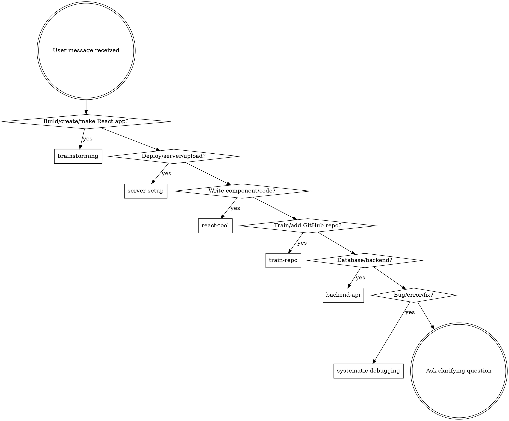

# React Full-Stack Pipeline

## Instruction Priority
1. User's explicit instructions (CLAUDE.md, direct requests) — highest
2. Pipeline skills — override defaults where they conflict
3. Default system prompt — lowest

## The Rule
Invoke relevant pipeline skills BEFORE any response or action. Even 1% chance a skill applies = invoke it.

## Intent Detection

## All Skills Reference

### Process Pipeline (9 skills)

| Skill | Trigger | What It Does |
|-------|---------|--------------|
| `react-pipeline:brainstorming` | "build/make/create a React app" | Requirements → design doc → approach recommendation |
| `react-pipeline:git-worktrees` | "start work on", before writing plans | Isolated git workspace |
| `react-pipeline:writing-plans` | After brainstorming approval | Bite-sized implementation plan (2-5 min tasks) |
| `react-pipeline:subagent-dev` | After plan written | Execute plan via fresh subagent per task |
| `react-pipeline:tdd` | Before writing implementation code | Red-green-refactor cycle |
| `react-pipeline:code-review` | Between tasks, before merge | Two-stage review (spec compliance + code quality) |
| `react-pipeline:finish-branch` | All tasks complete | Verify, present merge/PR options |
| `react-pipeline:security-audit` | Security review, audit, before deploy | Run security-auditor agent to check auth, input validation, data exposure |
| `react-pipeline:bootstrap` | Every session start | Intent detection, routing (this skill) |

### React Domain (4 skills)

| Skill | Trigger | What It Does |
|-------|---------|--------------|
| `react-pipeline:react-tool` | "write a component", "add a feature" | Write React code using knowledge base (14+ trained libs) |
| `react-pipeline:train-repo` | GitHub URL provided | Clone, extract api.md+patterns.md, update registry |
| `react-pipeline:component-design` | New component creation | Props design, composition, accessibility, performance |
| `react-pipeline:styling-system` | CSS/theme decisions | Tailwind, CSS-in-JS, design tokens, breakpoints |

### Deployment & Infrastructure (4 skills)

| Skill | Trigger | What It Does |
|-------|---------|--------------|
| `react-pipeline:server-setup` | "deploy", "setup server" | VPS/Nginx/SSL/DNS/firewall configuration |
| `react-pipeline:frontend-deploy` | "deploy frontend" | Build optimization, static hosting, CI/CD |
| `react-pipeline:docker-setup` | "docker", "containerize" | Dockerfile, compose, multi-stage builds |
| `react-pipeline:ci-cd` | "CI/CD", "pipeline" | GitHub Actions workflows |

### Backend (4 skills)

| Skill | Trigger | What It Does |
|-------|---------|--------------|
| `react-pipeline:backend-api` | "backend", "API" | REST/GraphQL routes, middleware, validation |
| `react-pipeline:database` | "database", "schema" | Schema design, migrations, ORM patterns |
| `react-pipeline:auth` | "auth", "login" | JWT/OAuth/RBAC/session management |
| `react-pipeline:api-client` | "connect to API" | TanStack Query, tRPC, optimistic updates |

## Skill Priority
1. **Process skills first** (brainstorming, planning) — determine HOW
2. **Implementation skills second** (react-tool, tdd) — guide execution
3. **Deployment skills third** (server-setup, frontend-deploy) — ship it
4. **Backend skills fourth** (backend-api, database, auth) — serve it

## Knowledge Base
`knowledge/registry.json` — trained repos index (14 repos, 12 categories)
`knowledge/repos/<category>/<slug>/` — api.md + patterns.md per repo

## Red Flags
| Thought | Reality |
|---------|---------|
| "This is just a simple question" | Questions are tasks. Check skills. |
| "I know this library already" | Knowledge base has structured API docs. Check first. |
| "Let me write it from scratch" | Trained repos exist. Check react-tool first. |
| "I'll figure out deployment later" | server-setup skill exists. Use it now. |
| "This is frontend only, no security needed" | Run security-auditor agent before deploy. Auth, input validation, data exposure matter. |
| "Backend testing is different from frontend" | TDD skill now includes backend API testing patterns (Hono + SQL.js). |
