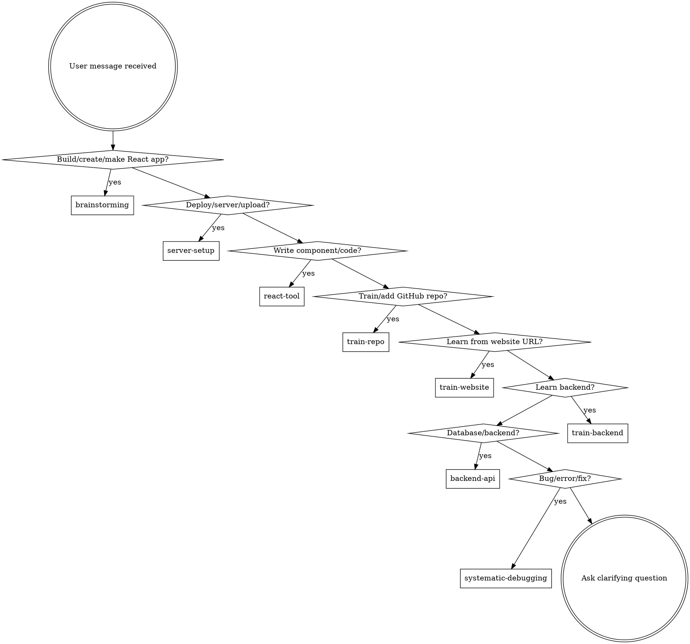

# React Full-Stack Pipeline

## Instruction Priority
1. User's explicit instructions (CLAUDE.md, direct requests) — highest
2. Pipeline skills — override defaults where they conflict
3. Default system prompt — lowest

## The Rule
Invoke relevant pipeline skills BEFORE any response or action. Even 1% chance a skill applies = invoke it.

## Intent Detection

## All Skills Reference

### Process Pipeline (9 skills)

| Skill | Trigger | What It Does |
|-------|---------|--------------|
| `react-pipeline:bootstrap` | Every session start | Intent detection, routing (this skill) |
| `react-pipeline:brainstorming` | "build/make/create a React app" | Requirements → complete visual catalog (ALL 3 design systems + 16 artistic styles + 12 fonts + 8 layouts in ONE message) → design doc → approach recommendation |
| `react-pipeline:git-worktrees` | "start work on", before writing plans | Isolated git workspace |
| `react-pipeline:writing-plans` | After brainstorming approval | Bite-sized implementation plan (2-5 min tasks) |
| `react-pipeline:subagent-dev` | After plan written | Execute plan via fresh subagent per task (includes security-auditor agent for auth/input/data checks) |
| `react-pipeline:tdd` | Before writing implementation code | Red-green-refactor cycle |
| `react-pipeline:code-review` | Between tasks, before merge | Two-stage review (spec compliance + code quality) |
| `react-pipeline:visual-check` | Before merge, after deploy | Browser-based visual verification, screenshot comparison, responsive check |
| `react-pipeline:finish-branch` | All tasks complete | Verify, present merge/PR options |

### React Domain (5 skills)

| Skill | Trigger | What It Does |
|-------|---------|--------------|
| `react-pipeline:react-tool` | "write a component", "add a feature" | Write React code using knowledge base (43+ trained repos, design-inspiration) |
| `react-pipeline:train-repo` | GitHub URL provided | Clone, extract 4D knowledge (api + patterns + interactions + design tokens), update registry |
| `react-pipeline:train-website` | Website URL provided, "learn from this site" | Fetch website with responsible fetching (15 reqs max, 2s delay, circuit breaker), extract full design system, write design-system.md |
| `react-pipeline:component-design` | New component creation | Props design, composition, accessibility, performance |
| `react-pipeline:styling-system` | CSS/theme decisions | Tailwind, CSS-in-JS, design tokens, breakpoints |

### Deployment & Infrastructure (4 skills)

| Skill | Trigger | What It Does |
|-------|---------|--------------|
| `react-pipeline:server-setup` | "deploy", "setup server" | VPS/Nginx/SSL/DNS/firewall configuration |
| `react-pipeline:frontend-deploy` | "deploy frontend" | Build optimization, static hosting, CI/CD |
| `react-pipeline:docker-setup` | "docker", "containerize" | Dockerfile, compose, multi-stage builds |
| `react-pipeline:ci-cd` | "CI/CD", "pipeline" | GitHub Actions workflows |

### Backend (5 skills)

| Skill | Trigger | What It Does |
|-------|---------|--------------|
| `react-pipeline:backend-api` | "backend", "API" | REST/GraphQL routes, middleware, validation |
| `react-pipeline:database` | "database", "schema" | Schema design, migrations, ORM patterns |
| `react-pipeline:auth` | "auth", "login" | JWT/OAuth/RBAC/session management |
| `react-pipeline:api-client` | "connect to API" | TanStack Query, tRPC, optimistic updates |
| `react-pipeline:train-backend` | "learn backend", "train backend patterns" | Search GitHub for backend repos (500+ stars), extract 4D knowledge (api + patterns + backend-patterns + api-patterns) |

## Skill Priority
1. **Process skills first** (brainstorming, planning) — determine HOW
2. **Implementation skills second** (react-tool, tdd) — guide execution
3. **Deployment skills third** (server-setup, frontend-deploy) — ship it
4. **Backend skills fourth** (backend-api, database, auth) — serve it

## Knowledge Base
`knowledge/registry.json` — trained repos + website extractions index (26+ repos, 14 categories)
`knowledge/repos/<category>/<slug>/` — api.md + patterns.md (+ interaction-patterns.md + design-tokens.md for frontend, + backend-patterns.md + api-patterns.md for backend)
`knowledge/websites/<slug>/` — design-system.md (complete design system extraction from live websites)

## gstack Coexistence

When gstack (`garrytan/gstack`) is also installed, the two plugins complement each other. gstack handles the full dev lifecycle (idea→design→QA→ship→retro) with browser-based testing. Our plugin handles React-specific implementation with triple-path knowledge extraction.

### Detection

gstack is present when `~/.claude/skills/gstack/SKILL.md` exists. Check this before routing.

### Routing Rules (when both plugins exist)

| Task Domain | Route To | Reason |
|-------------|----------|--------|
| React component/feature implementation | `react-pipeline:*` | Our React knowledge base (43+ trained repos) |
| GitHub repo training (frontend) | `react-pipeline:train-repo` | 4D extraction model |
| Website design extraction | `react-pipeline:train-website` | Responsible fetching policy built-in |
| Backend API training | `react-pipeline:train-backend` | 4D backend extraction |
| Visual design review of live site | gstack `design-review` | Playwright-based visual inspection |
| Design consultation / brand identity | gstack `design-consultation` | DESIGN.md methodology |
| QA testing / browser-based verification | gstack `qa` or `browse` | Headless Chromium (~100-200ms/command) |
| Bug investigation | gstack `investigate` | Structured debugging workflow |
| Shipping / deployment | gstack `ship` if gstack deploy configured, else `react-pipeline:server-setup` | Respect existing deploy config |
| Code review (general) | gstack `review` | Code quality + diff analysis |
| React-specific code review | `react-pipeline:code-review` | React-aware review with knowledge base context |
| Screenshot / visual regression | gstack `browse` | Annotated screenshots, diff snapshots |
| Security audit | Either — both have security-reviewer agent | Use whichever is configured |
| Dashboard / code health | gstack `health` | Code quality dashboard |

### Overlap Resolution

When a task could go to either plugin:
1. **React-specific work** → `react-pipeline:*` (knowledge base advantage)
2. **Browser/visual work** → gstack (Playwright advantage)
3. **Design thinking** → gstack (design-consultation methodology)
4. **Knowledge extraction** → `react-pipeline:train-*` (structured 4D model)
5. **Deployment** → Check if gstack deploy is configured first; fall back to react-pipeline

### Coexistence Notes

- gstack's `browse` binary provides browser testing our plugin lacks — prefer it for visual QA
- Our `train-website` has responsible fetching safeguards gstack lacks — prefer it for design extraction
- When both plugins can do a task, explain the tradeoff and let the user choose
- Never invoke both plugins' skills for the same task — pick one and commit

## Red Flags
| Thought | Reality |
|---------|---------|
| "This is just a simple question" | Questions are tasks. Check skills. |
| "I know this library already" | Knowledge base has structured API docs. Check first. |
| "Let me write it from scratch" | Trained repos exist. Check react-tool first. |
| "Just style it simply, we'll fix design later" | Design-inspiration knowledge base exists. Check websites/ for matching styles. |
| "Let me fetch all their CSS files to analyze" | Responsible fetching policy: max 15 reqs, 2s delay, circuit breaker. Small sites get 5 reqs. Read `knowledge/responsible-fetching.md`. |
| "I'll figure out deployment later" | server-setup skill exists. Use it now. |
| "This is frontend only, no security needed" | Run security-auditor agent before deploy. Auth, input validation, data exposure matter. |
| "Backend testing is different from frontend" | TDD skill now includes backend API testing patterns (Hono + SQL.js). |
| "I'll use gstack for design review of this React component" | gstack does visual review; our code-review does React-aware review. Use the right tool for the layer. |
| "Let me extract this website's design with gstack browse" | gstack browse doesn't have responsible fetching safeguards. Use react-pipeline:train-website instead. |
| "gstack and react-pipeline are competitors, pick one" | They complement: gstack = browser/QA/design-review; react-pipeline = React implementation/knowledge extraction. Use both where each excels. |
| "I need to screenshot this page, let me use the train-website skill" | train-website extracts design systems, not screenshots. Use gstack browse for visual QA if gstack is installed. |
| "Let me show 3 styles now, then ask if they want more" | Present ALL styles in ONE message. Never incrementally. 3→4→16 is the #1 UX complaint. |
| "I'll describe the styles in text, that's enough" | Every base design system card MUST include a CSS snippet. Visual decisions need visual previews. |
| "The artistic styles are in the knowledge files, I'll mention them" | Show the full 16-row reference matrix inline. Never hide content behind file references. |
| "I'll present design systems first, then artistic styles in a follow-up" | Batch everything: base systems + artistic styles + fonts + layouts + websites + image sources in ONE catalog message. |
| "The user didn't ask about images, so I won't mention them" | Proactively present Part F (7 image sources). Don't wait for users to discover what we have. |
| "I'll only mention what I remember — 影视飓风, unDraw, etc. are in knowledge files" | Read knowledge/image-sources.md before brainstorming. Present ALL sources. |
